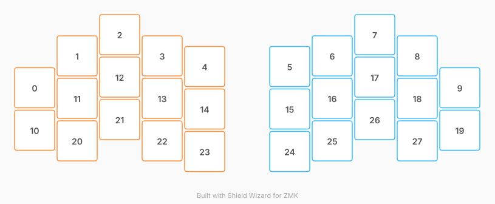

# ZMK Configuration for poc

*Generated by Shield Wizard for ZMK* <https://shield-wizard.genteure.com/>



Download compiled firmware from the Actions tab. <https://zmk.dev/docs/user-setup#installing-the-firmware>

Edit your keymap <https://nickcoutsos.github.io/keymap-editor/>, <https://zmk.dev/docs/keymaps>.
User keymap is located at [`config/poc.keymap`](config/poc.keymap).

-----

<details>
<summary>
Shield Wizard Debug Information
</summary>

In case of broken configuration, here is the Shield Wizard internal data used to generate this configuration:

Commit: c6078aab2a34eefa8ab8d00f2fc656779fdcfa46

```json
{"name":"poc","shield":"poc","dongle":true,"modules":[],"layout":[{"id":"01KZVYJAZA1FSK75NRNBETNPWB","part":0,"row":0,"col":0,"w":1,"h":1,"x":0,"y":0.75,"r":0,"rx":0,"ry":0},{"id":"01KZVYJB4PX4JFHW6CFFK9NY3P","part":0,"row":0,"col":1,"w":1,"h":1,"x":1,"y":0,"r":0,"rx":0,"ry":0},{"id":"01KZVYJB9VQTGBKFY3MZHBDZG3","part":0,"row":0,"col":2,"w":1,"h":1,"x":2,"y":-0.5,"r":0,"rx":0,"ry":0},{"id":"01KZVYJBEVHXTC5PZFG9181BFX","part":0,"row":0,"col":3,"w":1,"h":1,"x":3,"y":0,"r":0,"rx":0,"ry":0},{"id":"01KZVYJBKS6Z3WWR1Z3P1W3SW4","part":0,"row":0,"col":4,"w":1,"h":1,"x":4,"y":0.25,"r":0,"rx":0,"ry":0},{"id":"01KZVYJBS58YPYG60X5QKSRDKQ","part":1,"row":0,"col":5,"w":1,"h":1,"x":6,"y":0.25,"r":0,"rx":0,"ry":0},{"id":"01KZVYJBYSAZQJD7CMGD7ZZF99","part":1,"row":0,"col":6,"w":1,"h":1,"x":7,"y":0,"r":0,"rx":0,"ry":0},{"id":"01KZVYJC3PEVGWFHNV0VPVS2PF","part":1,"row":0,"col":7,"w":1,"h":1,"x":8,"y":-0.5,"r":0,"rx":0,"ry":0},{"id":"01KZVYJCA4SB79J80FX29GAB6G","part":1,"row":0,"col":8,"w":1,"h":1,"x":9,"y":0,"r":0,"rx":0,"ry":0},{"id":"01KZVYJCGXBJDPZWHSXX5KDM0C","part":1,"row":0,"col":9,"w":1,"h":1,"x":10,"y":0.75,"r":0,"rx":0,"ry":0},{"id":"01KZVYJH3Q5YZMFA99CP7QSF2D","part":0,"row":1,"col":0,"w":1,"h":1,"x":0,"y":1.75,"r":0,"rx":0,"ry":0},{"id":"01KZVYJH3RSXR3V9J2WSDGVWHV","part":0,"row":1,"col":1,"w":1,"h":1,"x":1,"y":1,"r":0,"rx":0,"ry":0},{"id":"01KZVYJH3RD8FSCMQF4JPTXS21","part":0,"row":1,"col":2,"w":1,"h":1,"x":2,"y":0.5,"r":0,"rx":0,"ry":0},{"id":"01KZVYJH3RDTSRHNJ4G4JNXJ3X","part":0,"row":1,"col":3,"w":1,"h":1,"x":3,"y":1,"r":0,"rx":0,"ry":0},{"id":"01KZVYJH3R7N3AQMG1KV7H3D5C","part":0,"row":1,"col":4,"w":1,"h":1,"x":4,"y":1.25,"r":0,"rx":0,"ry":0},{"id":"01KZVYJH3R29KM39QP9Z6QQ8MN","part":1,"row":1,"col":5,"w":1,"h":1,"x":6,"y":1.25,"r":0,"rx":0,"ry":0},{"id":"01KZVYJH3RSW7K3Q0KS1HVVR6Q","part":1,"row":1,"col":6,"w":1,"h":1,"x":7,"y":1,"r":0,"rx":0,"ry":0},{"id":"01KZVYJH3RTBVVHW915NQW5PF9","part":1,"row":1,"col":7,"w":1,"h":1,"x":8,"y":0.5,"r":0,"rx":0,"ry":0},{"id":"01KZVYJH3R2BNEJV18VF7ZRBCH","part":1,"row":1,"col":8,"w":1,"h":1,"x":9,"y":1,"r":0,"rx":0,"ry":0},{"id":"01KZVYJH3RXMK0NCEVTBDZX2AD","part":1,"row":1,"col":9,"w":1,"h":1,"x":10,"y":1.75,"r":0,"rx":0,"ry":0},{"id":"01KZVYJJ1QTVQPP5WF2KZG2VRJ","part":0,"row":2,"col":1,"w":1,"h":1,"x":1,"y":2,"r":0,"rx":0,"ry":0},{"id":"01KZVYJJ1R4MVHQJ6PN0R8GQVA","part":0,"row":2,"col":2,"w":1,"h":1,"x":2,"y":1.5,"r":0,"rx":0,"ry":0},{"id":"01KZVYJJ1R5H6FN2HR78A2RWNM","part":0,"row":2,"col":3,"w":1,"h":1,"x":3,"y":2,"r":0,"rx":0,"ry":0},{"id":"01KZVYJJ1RAW6XPRWC81JYT3Q5","part":0,"row":2,"col":4,"w":1,"h":1,"x":4,"y":2.25,"r":0,"rx":0,"ry":0},{"id":"01KZVYJJ1RK3KVNY05MKYFWT9J","part":1,"row":2,"col":5,"w":1,"h":1,"x":6,"y":2.25,"r":0,"rx":0,"ry":0},{"id":"01KZVYJJ1R9N625JVA2Y12XHJR","part":1,"row":2,"col":6,"w":1,"h":1,"x":7,"y":2,"r":0,"rx":0,"ry":0},{"id":"01KZVYJJ1RMXAQMHM9AB1MESTJ","part":1,"row":2,"col":7,"w":1,"h":1,"x":8,"y":1.5,"r":0,"rx":0,"ry":0},{"id":"01KZVYJJ1RWDCRTPAWBGZTCJ5Z","part":1,"row":2,"col":8,"w":1,"h":1,"x":9,"y":2,"r":0,"rx":0,"ry":0}],"parts":[{"name":"left","controller":"nice_nano_v2","pins":{"d20":{"usage":"kscan","kscan":"01KZVZ0B7ZSV46NANA56NZ8MEM","role":"input"},"d2":{"usage":"kscan","kscan":"01KZVZ0B7ZSV46NANA56NZ8MEM","role":"input"},"d3":{"usage":"kscan","kscan":"01KZVZ0B7ZSV46NANA56NZ8MEM","role":"input"},"d21":{"usage":"kscan","kscan":"01KZVZ0B7ZSV46NANA56NZ8MEM","role":"input"},"d19":{"usage":"kscan","kscan":"01KZVZ0B7ZSV46NANA56NZ8MEM","role":"input"},"d4":{"usage":"kscan","kscan":"01KZVZ0B7ZSV46NANA56NZ8MEM","role":"input"},"d18":{"usage":"kscan","kscan":"01KZVZ0B7ZSV46NANA56NZ8MEM","role":"input"},"d5":{"usage":"kscan","kscan":"01KZVZ0B7ZSV46NANA56NZ8MEM","role":"input"},"d15":{"usage":"kscan","kscan":"01KZVZ0B7ZSV46NANA56NZ8MEM","role":"input"},"d6":{"usage":"kscan","kscan":"01KZVZ0B7ZSV46NANA56NZ8MEM","role":"input"},"d14":{"usage":"kscan","kscan":"01KZVZ0B7ZSV46NANA56NZ8MEM","role":"input"},"d7":{"usage":"kscan","kscan":"01KZVZ0B7ZSV46NANA56NZ8MEM","role":"input"},"d16":{"usage":"kscan","kscan":"01KZVZ0B7ZSV46NANA56NZ8MEM","role":"input"},"d8":{"usage":"kscan","kscan":"01KZVZ0B7ZSV46NANA56NZ8MEM","role":"input"}},"kscans":[{"kind":"direct","id":"01KZVZ0B7ZSV46NANA56NZ8MEM","mode":"gnd"}],"keys":{"01KZVYJAZA1FSK75NRNBETNPWB":{"input":"d21"},"01KZVYJH3Q5YZMFA99CP7QSF2D":{"input":"d2"},"01KZVYJB4PX4JFHW6CFFK9NY3P":{"input":"d20"},"01KZVYJH3RSXR3V9J2WSDGVWHV":{"input":"d3"},"01KZVYJJ1QTVQPP5WF2KZG2VRJ":{"input":"d19"},"01KZVYJB9VQTGBKFY3MZHBDZG3":{"input":"d4"},"01KZVYJH3RD8FSCMQF4JPTXS21":{"input":"d18"},"01KZVYJJ1R4MVHQJ6PN0R8GQVA":{"input":"d5"},"01KZVYJBEVHXTC5PZFG9181BFX":{"input":"d15"},"01KZVYJH3RDTSRHNJ4G4JNXJ3X":{"input":"d6"},"01KZVYJJ1R5H6FN2HR78A2RWNM":{"input":"d14"},"01KZVYJBKS6Z3WWR1Z3P1W3SW4":{"input":"d7"},"01KZVYJH3R7N3AQMG1KV7H3D5C":{"input":"d16"},"01KZVYJJ1RAW6XPRWC81JYT3Q5":{"input":"d8"}},"encoders":[],"buses":{}},{"name":"right","controller":"nice_nano_v2","pins":{"d21":{"usage":"kscan","kscan":"01KZVZB0AGZZD24X4NJG5XETQF","role":"input"},"d2":{"usage":"kscan","kscan":"01KZVZB0AGZZD24X4NJG5XETQF","role":"input"},"d20":{"usage":"kscan","kscan":"01KZVZB0AGZZD24X4NJG5XETQF","role":"input"},"d3":{"usage":"kscan","kscan":"01KZVZB0AGZZD24X4NJG5XETQF","role":"input"},"d19":{"usage":"kscan","kscan":"01KZVZB0AGZZD24X4NJG5XETQF","role":"input"},"d4":{"usage":"kscan","kscan":"01KZVZB0AGZZD24X4NJG5XETQF","role":"input"},"d18":{"usage":"kscan","kscan":"01KZVZB0AGZZD24X4NJG5XETQF","role":"input"},"d5":{"usage":"kscan","kscan":"01KZVZB0AGZZD24X4NJG5XETQF","role":"input"},"d15":{"usage":"kscan","kscan":"01KZVZB0AGZZD24X4NJG5XETQF","role":"input"},"d6":{"usage":"kscan","kscan":"01KZVZB0AGZZD24X4NJG5XETQF","role":"input"},"d14":{"usage":"kscan","kscan":"01KZVZB0AGZZD24X4NJG5XETQF","role":"input"},"d7":{"usage":"kscan","kscan":"01KZVZB0AGZZD24X4NJG5XETQF","role":"input"},"d16":{"usage":"kscan","kscan":"01KZVZB0AGZZD24X4NJG5XETQF","role":"input"},"d8":{"usage":"kscan","kscan":"01KZVZB0AGZZD24X4NJG5XETQF","role":"input"}},"kscans":[{"kind":"direct","id":"01KZVZB0AGZZD24X4NJG5XETQF","mode":"gnd"}],"keys":{"01KZVYJCGXBJDPZWHSXX5KDM0C":{"input":"d21"},"01KZVYJH3RXMK0NCEVTBDZX2AD":{"input":"d2"},"01KZVYJCA4SB79J80FX29GAB6G":{"input":"d20"},"01KZVYJH3R2BNEJV18VF7ZRBCH":{"input":"d3"},"01KZVYJJ1RWDCRTPAWBGZTCJ5Z":{"input":"d19"},"01KZVYJC3PEVGWFHNV0VPVS2PF":{"input":"d4"},"01KZVYJH3RTBVVHW915NQW5PF9":{"input":"d18"},"01KZVYJJ1RMXAQMHM9AB1MESTJ":{"input":"d5"},"01KZVYJBYSAZQJD7CMGD7ZZF99":{"input":"d15"},"01KZVYJH3RSW7K3Q0KS1HVVR6Q":{"input":"d6"},"01KZVYJJ1R9N625JVA2Y12XHJR":{"input":"d14"},"01KZVYJBS58YPYG60X5QKSRDKQ":{"input":"d7"},"01KZVYJH3R29KM39QP9Z6QQ8MN":{"input":"d16"},"01KZVYJJ1RK3KVNY05MKYFWT9J":{"input":"d8"}},"encoders":[],"buses":{}}]}
```

</details>
